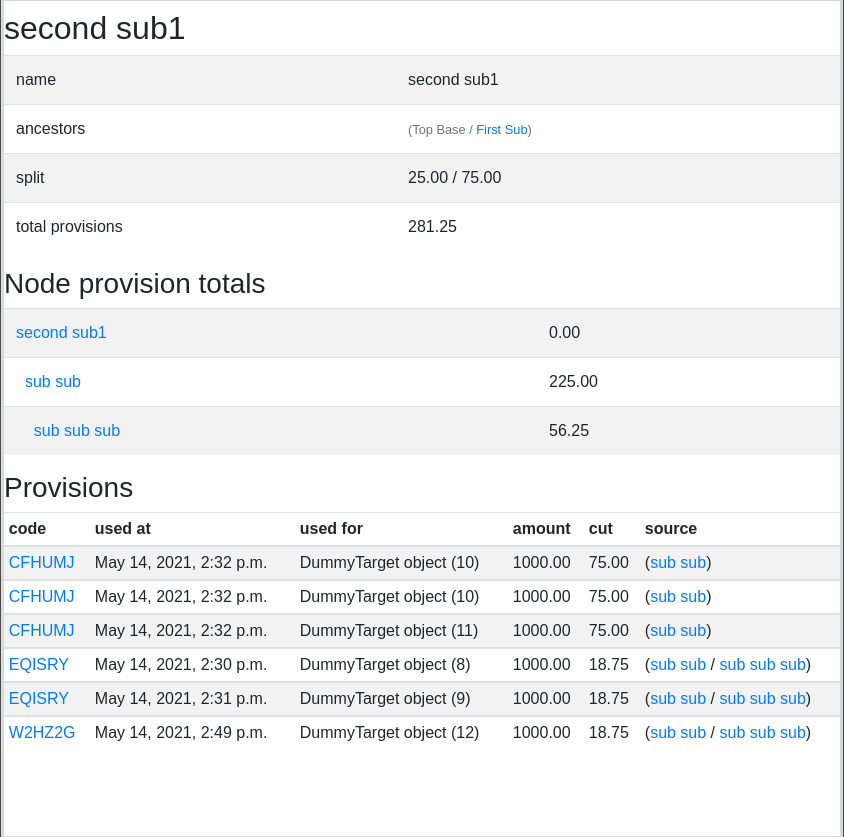
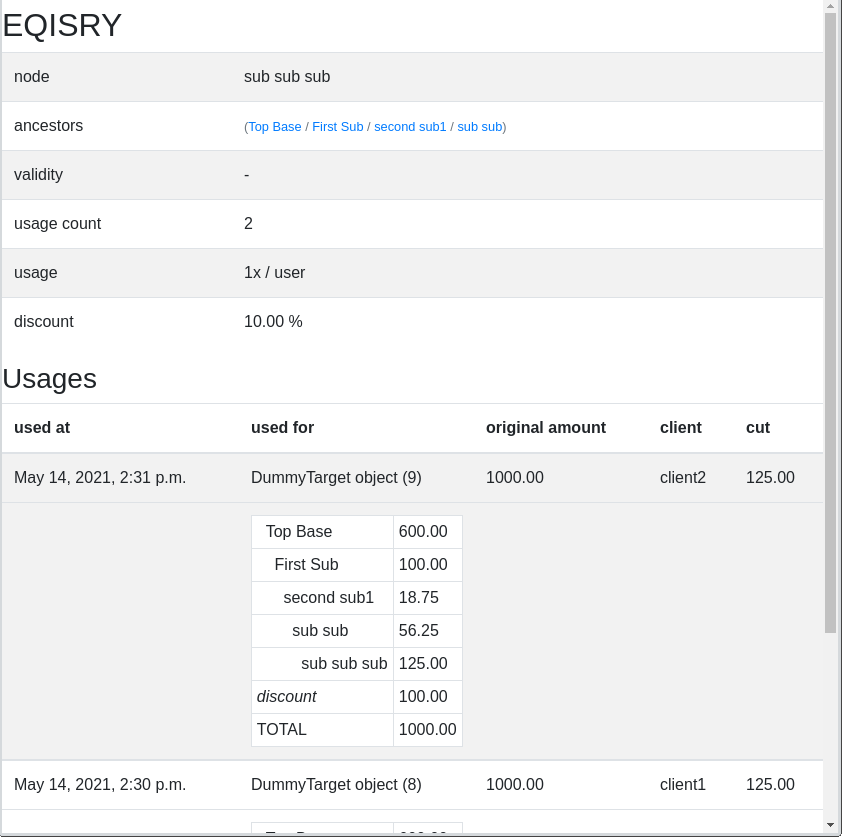
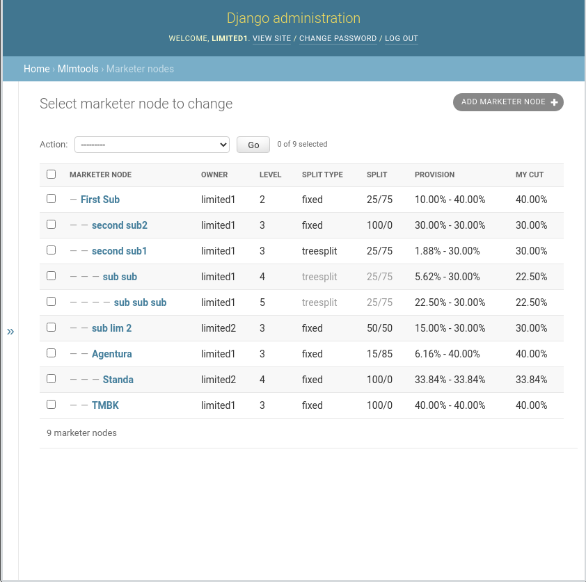
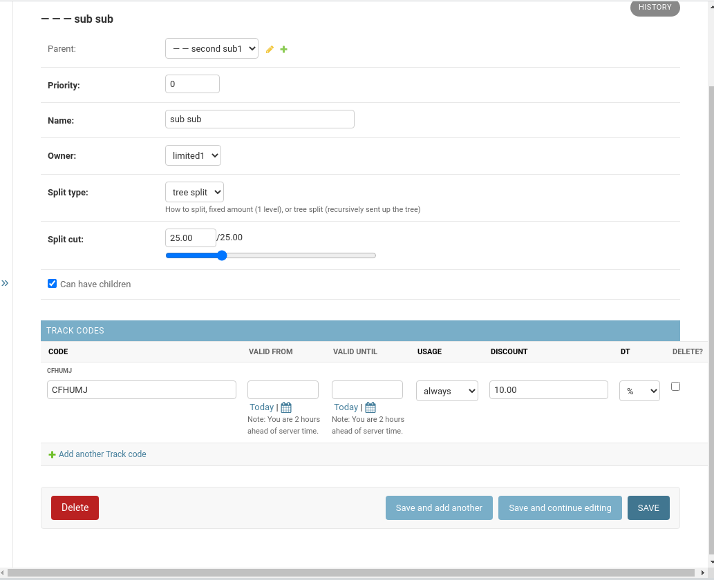

# mlmprovisions

Reusable Django app, that allows you to track provisions
for your affiliate partners. It has a flexible way of configuring how to 
split the provision and is capable of running 
**multi-level marketing**

## Screenshots





## Instalation
```bash
pip install mlmprovisions
```
Then add required apps **settings.py**
```python
INSTALLED_APPS = [
    ...
    'treenode',
    'mlmtools',
    'floppyforms',
    ...
]
```

Add to the **urls.py**
```python
    path('mlmtools/', include('mlmtools.urls'))
```
And sync the db
```bash
python manage.py makemigrations
python manage.py migrate
```


## Configuration and usage
Using the admin interface add marketer nodes and tracking codes for them.
We suggest adding 1 central node and several subnodes

Fields:
* **Owner** - the user this note is associated to
* **Split type** - how to split the provision
  * **fixed** - this node takes a fixed percentage*
  * **tree split** - MultiLevel split. This split is how much is sent up the tree
* **Split cut** - the slider how much we keep and how much we pass to the child nodes
* **Can have children** - whether the subnodes can create subnodes (MLM needs this)  
* **track code usage** - how many times can the code be used (limitless/only once for all/only once per user)

To add attribution you have 2 methods
```python
from mlmtools.models import TrackCode, CodeUse
str_code = "CFHUMJ"

#tells if this code can be used
CodeUse.test_use(str_code, client_user) #tells if this code can be used

#lets have something like an order (the track code uses generic relation)
dt = DummyTarget(name="my order target 2", amount=1000.0)
dt.save() 

#and attach the code
CodeUse.use(str_code, client_user, target=dt, amount=dt.amount)
```

And finaly you can check how it looks by visitin
```
http://<yoursite/mlmtools/list_codes/
```

ENJOY!
